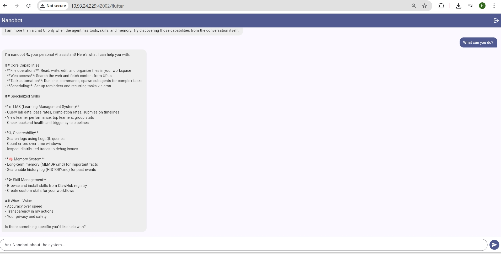
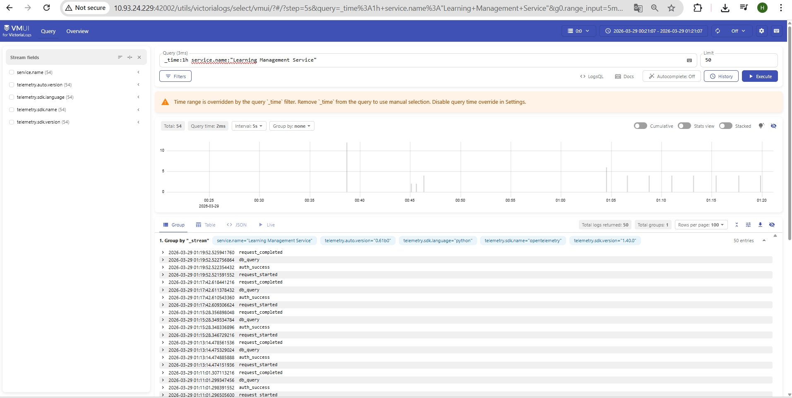
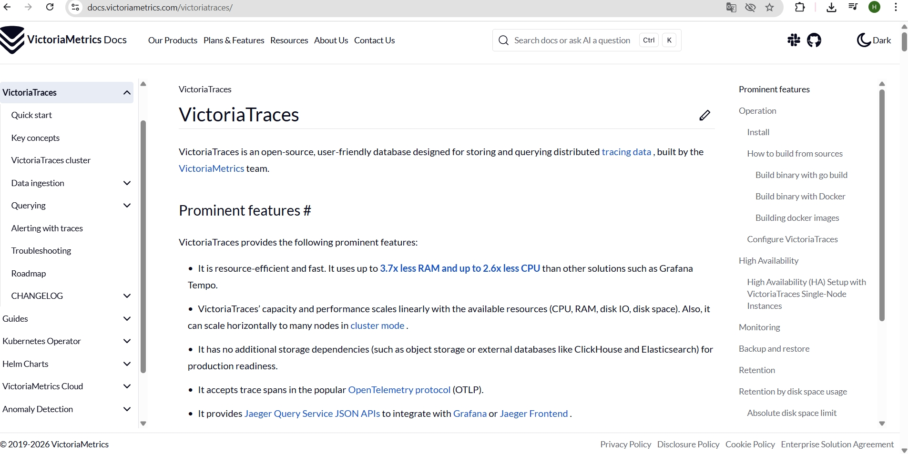
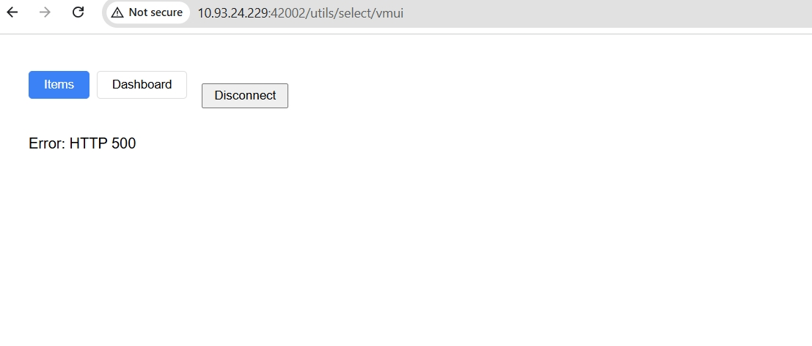

# Lab 8 — Report

Paste your checkpoint evidence below. Add screenshots as image files in the repo and reference them with ``.

## Task 1A — Bare agent

**Question: "What is the agentic loop?"**
> The **agentic loop** is the fundamental cycle that autonomous AI agents follow to accomplish tasks. It's the core reasoning and action pattern that enables agents to work independently toward goals.
> 
> The Basic Loop:
> 1. Perceive — Observe the current state of the environment or context
> 2. Think/Reason — Analyze the situation, plan next steps, make decisions
> 3. Act — Execute actions (call tools, modify files, send messages, etc.)
> 4. Observe Results — See the outcome of the action
> 5. Repeat — Continue until the goal is achieved

**Question: "What labs are available in our LMS?"**
> Based on my exploration of the workspace, here are the available labs in your LMS:
> 
> Required Labs (Lab 8):
> 1. Task 1 — Set Up the Agent
> 2. Task 2 — Deploy and Connect a Web Client
> 3. Task 3 — Give the Agent New Eyes
> 4. Task 4 — Diagnose a Failure and Make the Agent Proactive
> 
> (Answered from local repo files, not real LMS backend data)

## Task 1B — Agent with LMS tools

**Question: "What labs are available?"**
> Here are the available labs from the LMS system:
> 
> | ID | Title |
> |----|-------|
> | 1 | Lab 01 – Products, Architecture & Roles |
> | 2 | Lab 02 — Run, Fix, and Deploy a Backend Service |
> | 3 | Lab 03 — Backend API: Explore, Debug, Implement, Deploy |
> | 4 | Lab 04 — Testing, Front-end, and AI Agents |
> | 5 | Lab 05 — Data Pipeline and Analytics Dashboard |
> | 6 | Lab 06 — Build Your Own Agent |
> | 7 | Lab 07 — Build a Client with an AI Coding Agent |
> | 8 | lab-08 |

**Question: "Is the LMS backend healthy?"**
> Yes, the LMS backend is healthy! It's currently tracking 56 items.

## Task 1C — Skill prompt

**Question: "Show me the scores"**
> I'll help you check the scores! First, let me get the list of available labs so you can choose which one you'd like to see.
> 
> Here are the available labs:
> 1. Lab 01 – Products, Architecture & Roles
> 2. Lab 02 — Run, Fix, and Deploy a Backend Service
> 3. Lab 03 — Backend API: Explore, Debug, Implement, Deploy
> 4. Lab 04 — Testing, Front-end, and AI Agents
> 5. Lab 05 — Data Pipeline and Analytics Dashboard
> 6. Lab 06 — Build Your Own Agent
> 7. Lab 07 — Build a Client with an AI Coding Agent
> 8. Lab 08 — lab-08
> 
> Which lab would you like to see the scores for?

## Task 2A — Deployed agent

**Nanobot startup logs:**
```
MCP server 'lms': connected, 9 tools registered
MCP server 'webchat': connected, 1 tools registered
MCP server 'obs': connected, 4 tools registered
Agent loop started
```

## Task 2B — Web client

**Screenshot:**
<!--  -->

## Task 3A — Structured logging

**Happy-path log excerpt (request_started → request_completed with status 200):**
```
2026-03-28 19:22:45,544 INFO [lms_backend.main] - request_started
2026-03-28 19:22:45,547 INFO [lms_backend.auth] - auth_success
2026-03-28 19:22:45,548 INFO [lms_backend.db.items] - db_query
2026-03-28 19:22:45,664 INFO [lms_backend.main] - request_completed
INFO: 172.20.0.9:44096 - "GET /items/ HTTP/1.1" 200 OK
```

**Error-path log excerpt (db_query with error when PostgreSQL stopped):**
```
<!-- Add error logs here after stopping postgres -->
```

**VictoriaLogs query screenshot:**
<!--  -->

## Task 3B — Traces

**Healthy trace screenshot:**
<!--  -->

**Error trace screenshot:**
<!--  -->

## Task 3C — Observability MCP tools

**Normal conditions — "Any LMS backend errors in the last 10 minutes?":**
> Good news! The LMS backend is currently **healthy** with no errors reported.
>
> - **Status**: Healthy ✅
> - **Item count**: 56 items
> - **Errors**: None
>
> The backend appears to be running normally.

**Failure conditions (PostgreSQL stopped) — "Any LMS backend errors in the last 10 minutes?":**
> <!-- Add agent response here after stopping postgres -->

## Task 4A — Multi-step investigation

<!-- Paste the agent's response to "What went wrong?" showing chained log + trace investigation -->

## Task 4B — Proactive health check

<!-- Screenshot or transcript of the proactive health report that appears in the Flutter chat -->

## Task 4C — Bug fix and recovery

<!-- 1. Root cause identified
     2. Code fix (diff or description)
     3. Post-fix response to "What went wrong?" showing the real underlying failure
     4. Healthy follow-up report or transcript after recovery -->
